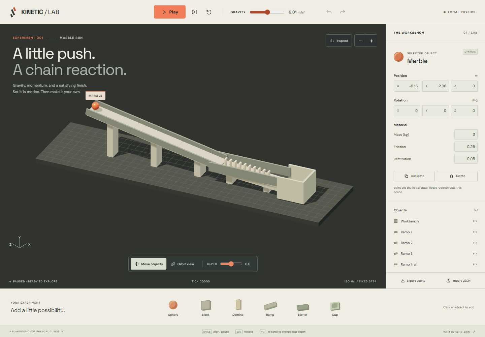
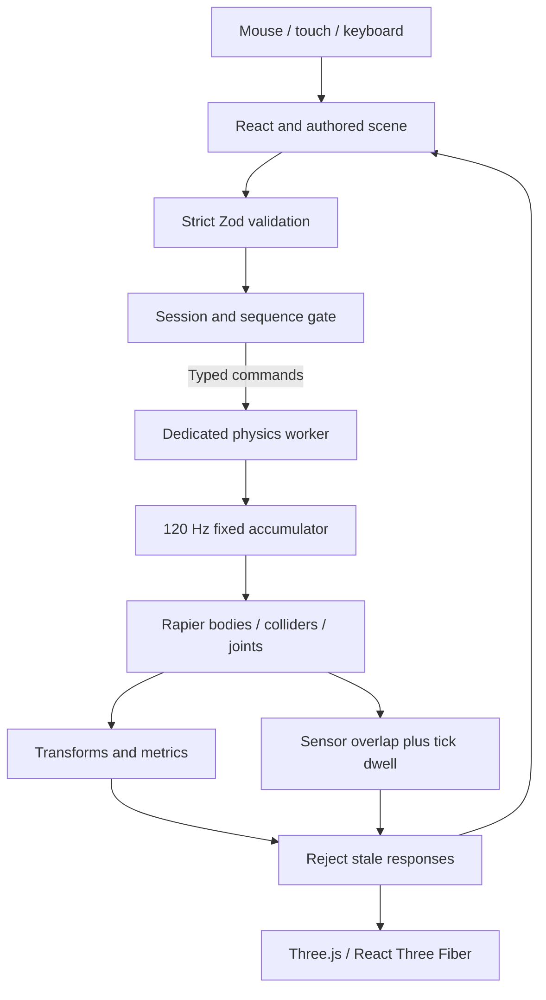

# Kinetic Lab

[](https://github.com/Sahil-Arifi/kinetic-lab/actions/workflows/ci.yml)

**Build a 3D scene, set it in motion, and investigate the physics.**

Kinetic Lab is a browser physics workshop built with TypeScript, React Three Fiber and Rapier. Edit a marble run, change gravity and material properties, then play, pause or advance the simulation one tick at a time.

**[Open the demo](https://kinetic-lab.netlify.app/)** · [Run locally](#run-locally) · [Architecture](docs/architecture.md) · [Validation evidence](artifacts/verification.md)



## Engineering highlights

- **Physics in a dedicated worker.** Rapier runs at a fixed 120 Hz timestep. Typed commands, session IDs and sequence checks isolate simulation state from React and reject stale worker responses.
- **An editable scene document.** Add, duplicate, move and inspect objects; undo or redo edits; import and export validated JSON. Running grabs use damped spring constraints.
- **Multiple ways to interact.** Mouse, touch and keyboard controls share the same authored scene, with a DOM object list and numeric inspector alongside the 3D canvas.
- **Measured behavior.** Real physics integration tests check free fall, momentum, reset behavior and repeated marble-run completion. Windows and Ubuntu CI also cover linting, TypeScript, per-file coverage and builds; Ubuntu runs browser and accessibility checks.

**Stack:** TypeScript · React · Three.js / React Three Fiber · Rapier · Zod · Vite · Vitest · Playwright

The committed [verification record](artifacts/verification.md) reports 98 unit/component/integration tests, 14 browser tests and two accessibility tests passing. The authored marble run completed in all five recorded trials at tick 593. These results describe the documented fixtures and environments, not universal physics accuracy or cross-platform determinism. The CI badge links to the current workflow status.

**Current scope:** a physics workshop with one starter experiment and primitive scene editing. Hand tracking is planned and is not implemented. See [current limitations](#current-limitations).

## Run locally

Use **Node 24.19.0** (`.nvmrc`) and **pnpm 11.19.0** (`packageManager`).

```sh
git clone https://github.com/Sahil-Arifi/kinetic-lab.git
cd kinetic-lab
pnpm install --frozen-lockfile
pnpm dev
```

Open the localhost URL printed by Vite, or [use the hosted demo](https://kinetic-lab.netlify.app/). The application starts paused. Fonts and WASM are bundled locally; there is no runtime dependency on an external service.

| Control                                           | Behavior                                                                                                |
| ------------------------------------------------- | ------------------------------------------------------------------------------------------------------- |
| Play / Pause, or Space outside editable fields    | Start or stop the simulation                                                                            |
| Single step                                       | Advance exactly one 1/120 second tick while paused                                                      |
| Reset                                             | Reconstruct the current authored scene, including your edits                                            |
| Move objects                                      | Select and drag; running uses a spring constraint, paused changes the authored position                 |
| Orbit view; Zoom in / out                         | Rotate with one pointer or finger; enlarge the selected object without multitouch                       |
| Depth slider; wheel or up/down arrows during drag | Adjust the grab plane depth                                                                             |
| Escape                                            | Cancel the current grab or discard an unfinished numeric edit                                           |
| Object list + inspector                           | Select without canvas interaction; edit position, rotation, mass, friction and restitution while paused |
| Object tray; Duplicate / Delete; Undo / Redo      | Edit the authored document, not arbitrary simulation history                                            |
| Gravity                                           | Change gravity, including zero gravity; Reset retains the authored value                                |
| Export scene / Import JSON                        | Save and load a validated local scene document                                                          |
| Inspect                                           | View live rendering and physics diagnostics                                                             |

## The technical problem

A responsive 3D editor must reconcile three different timelines: input events, rendering and numerical integration. Sending screen coordinates directly into rigid-body teleports produces unstable manipulation. Sharing a mutable world with React also makes reset and late worker responses difficult to reason about.

Kinetic Lab separates authored state from simulation state. A typed, session-scoped protocol transports commands and snapshots. The worker owns all physical resources, including temporary grab handles, joints and goal sensors. The renderer displays results without deciding the numerical timestep.

## Architecture and worker ownership

Only Drei's HTML-label and orbit-control helpers are imported directly. A pinned pnpm override removes Drei's unused transitive MediaPipe package; the repository check rejects any resolved MediaPipe or OpenAI package in the lockfile. Adding hand tracking later requires an explicit dependency and implementation review.



The main thread owns React, Three.js, the authored document, edit history and input. The worker exclusively owns the Rapier world, event queue, simulation clock, collision processing, sensors and grab constraints. React never mutates a Rapier body. Tests instantiate the same world directly using real Rapier, without substituting mocked physics.

Every command and response includes `protocolVersion`, `sessionId` and `sequence`. Load, reset and worker restart rotate the client session before sending a reconstruction command. The response gate rejects old sessions and duplicate/out-of-order sequences; worker generation guards reject callbacks after termination. These cases have automated regression tests with valid stale transform, goal, collision, metric and playback messages.

See [the architecture document](docs/architecture.md) for lifecycle, ownership and failure handling.

## Fixed timestep

The worker wakes on an 8 ms scheduler and accumulates elapsed wall time. Each integration step is exactly **1/120 second**. A scheduler iteration performs at most **five** catch-up steps, drops excess whole-step debt, and records the discarded seconds. Rendering cadence does not change `dt`.

Pause clears wall-time debt; hidden pages automatically pause and require an explicit Play to resume. Single step advances one tick only while paused. Transform snapshots target 60 Hz and metrics 4 Hz, independently of the physics rate.

## Scene schema

All built-in, edited and imported scenes pass through the same versioned Zod schema:

```ts
type SceneDocument = {
  schemaVersion: 1;
  id: string;
  name: string;
  seed: number;
  gravity: { x: number; y: number; z: number };
  bodies: BodyDocument[];
  goals: { id: string; bodyId: string; sensorBodyId: string; dwellTicks: number }[];
};
```

Bodies have stable IDs, type, name, position, Euler XYZ rotation, full dimensions, mass, friction, restitution and body mode. Supported types are `sphere`, `block`, `domino`, `ramp`, `fixedBarrier` and `targetCup`. Dimensions are metres, rotation is stored in radians and displayed in degrees, mass is kilograms, and simulation time is seconds. The explicit fixture does not need randomness; its seed is reserved for future deterministic generators.

The schema rejects non-finite values, invalid masses/dimensions, unsupported types, duplicate IDs and invalid goal references. Documents are limited to 200 bodies and 20 goals; imported JSON is limited to 1 MB. Strict objects and bounded plain-text labels permit no executable code, HTML, callbacks, arbitrary properties or external URLs. Sphere dimensions must match; cups and barriers must be fixed.

## Object grabbing

Running drags create a **collider-free kinematic handle** connected to the selected body by a damped Rapier spring joint. Pointer rays intersect a camera-facing plane with explicit depth adjustment. The handle moves through Rapier's next-kinematic-position method at no more than 12 m/s. Stiffness and damping scale with body mass.

Release preserves the simulated body velocity. There is no added throw impulse. Release, cancel, reset, replacement, deletion and disposal remove temporary resources; worker termination releases the complete WASM context. Paused drags commit authored scene edits, with numeric inspector controls as the keyboard alternative.

## Marble Run

The starter is deliberately authored rather than scripted: one marble, three solid ramps, ten dynamic dominoes, safety barriers, supports, a workbench and a finish cup. No animation curve or automatic impulse drives completion. Gravity, rolling contact and collisions produce the motion.

The cup has a solid floor and walls plus a **real Rapier interior sensor collider**. Its goal requires **45 consecutive overlapping simulation ticks**, or 0.375 simulation seconds. Leaving the sensor resets the dwell count. It emits once per reconstructed world, independent of wall-clock timers. Reset recreates the world from the latest authored document.

## Accessibility

The canvas is accompanied by a DOM object list and a labeled inspector. Native buttons and inputs support keyboard navigation; focus outlines are visible, the mobile inspector is collapsible, and the skip link opens it. Space respects editable fields. Touch users can choose Move objects or Orbit view with one finger and use visible zoom controls. Reduced-motion preferences disable cosmetic transitions; physics begins only after explicit playback.

A polite live region announces only discrete state changes: start, pause, selection, reset and goal completion. Per-frame transforms are not announced. Automated axe checks cover desktop controls, the Inspect panel and the opened mobile inspector. Automated checks do not replace assistive-technology user testing.

## Physics validation

These measurements validate **this implementation and these fixtures**. They are not proof of general scientific accuracy or cross-platform bitwise determinism, and they are not performance benchmarks.

Recorded with **Rapier 0.20.0**, Node **24.19.0**, Windows x64, `dt = 1/120 s`, and eight solver iterations:

| Experiment                             | Observed result                                    | Acceptance tolerance             |
| -------------------------------------- | -------------------------------------------------- | -------------------------------- |
| Free fall, 1 s                         | Position error **0.005097122192 m**                | ≤ 0.05 m                         |
| Zero-gravity momentum, 2 s             | Velocity error **1.33280037 × 10⁻⁸ m/s**           | ≤ 10⁻⁵ m/s                       |
| Supplemental momentum position         | Drift **0.001660639690 m**                         | ≤ 0.002 m                        |
| Reset to authored state, five resets   | Maximum authored-state error **2.30518590 × 10⁻⁷** | ≤ 10⁻⁶                           |
| Repeated initial snapshots             | Maximum difference **0**                           | Exact equality                   |
| 60 Hz, 144 Hz and irregular scheduling | State difference **0**, 720 ticks each             | ≤ 10⁻⁶; no dropped time          |
| Marble Run repeated reset              | **5/5**, goal at tick **593** every run            | Five successes, zero tick spread |

Each Marble Run records all three ramp contacts and nine adjacent domino contacts. The last domino topples and the marble remains settled in the cup after extended simulation.

[Full methodology, tolerances and fixture hash](docs/physics-validation.md) · [Machine-readable measurements and complete fixtures](artifacts/physics-validation.json)

```sh
pnpm validate:physics
```

The script asserts each bound before writing the report. It records Rapier/runtime versions, platform, timestep, solver settings, fixture SHA-256, tolerances and actual errors. A failure exits nonzero.

## Testing and CI

```sh
pnpm install --frozen-lockfile
pnpm lint
pnpm typecheck
pnpm test
pnpm test:coverage
pnpm build
pnpm exec playwright install chromium
pnpm test:e2e
pnpm test:a11y
```

Vitest covers schemas/configuration, protocol ordering/session isolation, accumulator limits, input adapters, undo/redo, metric calculations and real-Rapier integration. Testing Library covers DOM controls and edit cancellation. Coverage includes every file in `engine`, `input`, `editor`, `metrics` and `scenes`; **85% branch, statement, function and line coverage is enforced per file**, without exclusions for difficult engine branches. React rendering is checked separately by component tests, Playwright and visual review.

Playwright exercises real Chromium/WebGL and the built worker: playback, pause, exact stepping, reset, selection, mouse dragging, a running spring grab, keyboard controls, CDP touch input, gravity, editing and naturally repeated sensor completion. Every browser test fails on uncaught exceptions or console errors. Screenshots check **1440×1000**, **768×1024** and **390×844**, including horizontal overflow.

[GitHub Actions](https://github.com/Sahil-Arifi/kinetic-lab/actions) runs frozen installation, lint, strict TypeScript, tests, per-file coverage, build and physics validation on Windows and Ubuntu. Ubuntu additionally runs Chromium and axe. Action revisions are pinned; reports and traces are retained as workflow artifacts. Exact final executed results are recorded in [the verification record](artifacts/verification.md).

## Project map

- `src/engine/` — schema, protocol, client, runtime, accumulator, Rapier world, grabbing and sensors.
- `src/workers/physics.worker.ts` — dedicated worker bootstrap and scheduler.
- `src/scenes/` — primitive defaults and authored Marble Run.
- `src/editor/`, `src/input/`, `src/metrics/` — tested state operations, input policies and bounded statistics.
- `src/components/`, `src/hooks/` — rendering, accessible controls and application state.
- `tests/unit/`, `tests/integration/`, `tests/e2e/` — component/core, real physics and browser checks.
- `scripts/validate-physics.ts`, `docs/`, `artifacts/` — reproducible measurements and evidence.

## Current limitations

- One starter experiment. Scene editing supports primitives; it is not a CAD or arbitrary-mesh editor.
- Numerical checks concern specific fixtures and the pinned engine. They do not establish universal accuracy or determinism across all hardware, browsers or future Rapier versions.
- Chromium is the automated browser target. Mobile tests emulate touch; physical phones, Safari/Firefox and screen-reader user testing remain independent review work.
- A WebGL-capable browser is needed for the 3D view. DOM scene controls remain available when rendering is unavailable.
- Physics slows relative to wall time when it exceeds the five-step catch-up budget. Inspect exposes dropped time; no final performance conclusions are published.
- Three.js and Rapier/WASM make the initial download substantial. Bundle/startup optimization and representative-device benchmarks belong to the benchmark milestone.
- Goals use consecutive sensor overlap, not full geometric containment of the entire marble.
- Local JSON export is explicit; reload does not automatically persist a scene. No accounts, storage service or backend exist.

## Next milestone and flagship review

**Hand tracking is not implemented yet. MediaPipe integration is planned after the physics foundation is independently verified.**

First, independently review this foundation: validate the recorded evidence, interaction behavior, resource cleanup, real-device usability and numerical limits. Only after that review, introduce an opt-in, local MediaPipe hand-input adapter that maps calibrated hand poses into this existing typed grab protocol. That milestone must handle permissions, confidence loss, gesture hysteresis, cancellation and a visible pointer/keyboard fallback. It must preserve worker ownership and the deterministic physics validation suite.

Representative-device benchmarks, hand-tracking validation and final independent flagship review remain future completion gates. There are no OpenAI API calls, camera permissions, MediaPipe dependencies, analytics, accounts, databases, multiplayer or unnecessary services in this milestone.

Application code is MIT licensed; see [LICENSE](LICENSE). Locally bundled DM Sans and Space Grotesk fonts retain their [SIL Open Font licenses](public/licenses/), which also ship in the production build.
