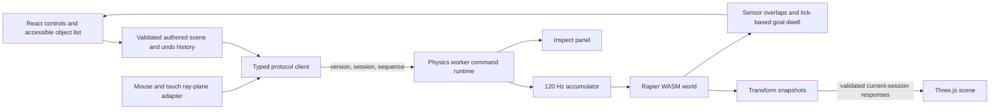

# Architecture

## Ownership and data flow

`PhysicsWorld` is instantiated only inside the worker runtime in production. Tests and the validation script instantiate it directly to exercise real Rapier. React never imports the world or Rapier. Render meshes consume snapshots through a ref without making each physics tick a React state update. The authored document remains distinct from the simulated transforms.

## Protocol and lifecycle

Every command and response carries `protocolVersion: 1`, a session ID, and a monotonic sequence number. Both directions pass through Zod contracts. A new client session is created before every load, reset and restart. The response gate rejects malformed, duplicate, out-of-order and previous-session messages before they reach React. A worker generation guard also rejects callbacks from a terminated worker.

Only `loadScene` and `reset` can introduce a worker session; retired sessions cannot be revived. Initialization and commands are serialized on one promise chain. Pointer moves are currently all delivered in order; no coalescing is required at this scene size. Begin, release, cancel and world replacement commands are never dropped by an input throttle.

Reset frees the prior world, event queue and constraints, then constructs bodies and colliders from the current validated authored scene in document order. Undo/redo changes that document and reconstructs the world; it does not replay physical history. Worker termination releases its complete WASM context; explicit world disposal also removes temporary handles and joints.

## Clock

The scheduler wakes every 8 ms. `FixedClock` accumulates elapsed wall seconds and integrates only `1/120` second steps. At most five steps execute per scheduler iteration. Excess whole steps are dropped and counted, while a fractional remainder is retained. Snapshot publication targets 60 Hz; metrics are published at 4 Hz. Neither rate changes integration dt.

Play and pause clear the accumulated wall time. Hiding the document pauses the simulation and cancels any grab. Returning to the page requires an explicit Play, preventing a long catch-up after background throttling. Single step advances one simulation tick only while paused.

## Scene documents

The schema is strict and versioned. All built-in, imported and edited scenes use the same validation path. Units are metres, kilograms, seconds and Euler XYZ radians. Sphere dimensions are equal diameters; other dimensions are full extents. Ramps are rotated solid cuboids. Barriers and target cups are fixed. Cup floor/walls are solid colliders; a separate interior collider is a sensor.

IDs use a bounded non-executable alphabet; names permit plain text only. Unknown fields, unsupported types, non-finite numbers, duplicate body/goal IDs, invalid references, nonpositive dynamic masses and unsafe dimensions are rejected. The scene is limited to 200 bodies, 20 goals and 1 MB imported JSON. There are no URLs, scripts, callbacks or network asset loaders in the format. The seed is reserved for deterministic generated scenes; the current fixture is explicitly authored and does not use random numbers.

## Grabbing and editing

While running, pointer input selects a body and intersects a camera-facing plane. A collider-free position-based kinematic handle connects to the dynamic body through a mass-scaled Rapier spring joint. The handle advances with `setNextKinematicTranslation`, bounded to 12 m/s. Stiffness is 120 times body mass; damping is 18 times body mass. Release removes the handle and joint without adding an artificial throw impulse.

Depth is a separate visible control, also adjustable with the wheel or arrow keys during a drag. Touch offers explicit Object and Orbit modes and requires no multitouch. Paused drags edit authored positions; numeric inspector controls provide equivalent keyboard access. Escape cancels an in-progress drag. Scene replacement and deletion reconstruct the world, removing any grab resources.

## Metrics and boundaries

Inspect reports mean render frame interval, draw calls, the most recent physics step duration, awake/sleeping dynamic body counts, tick count and dropped simulation seconds. These are live diagnostics, not a benchmark or a promise of throughput. WebGL renderer work and worker integration cost are different measurements.

No backend, camera, MediaPipe, accounts, analytics, cloud storage or API client is included. Scenes can be exported and imported as local JSON. See [physics-validation.md](physics-validation.md) for reproducible measured validation and its limits.
